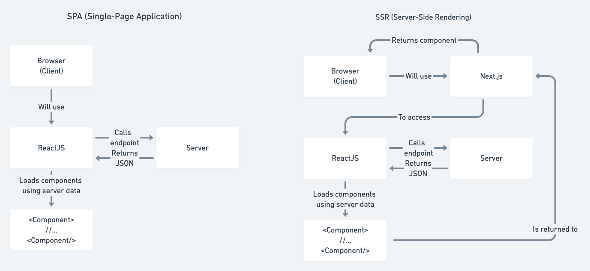

<h2>Módulo 3 - IG news</h2>

<p>Introduces Next.js and a common project architecture for Next.js projects that the front-end
shouldn't depend on the back-end to be developed. 
</p> 
<p>Before starting the project an important 
step is to install dependencies:</p>

```
yarn

//or

npm install
```
<p>Open the Next.js app by running:</p>

```
yarn dev
```


## :rocket: Technologies

This project was developed with the following technologies:

-  [ReactJS](https://reactjs.org/)
-  [Typescript](https://www.typescriptlang.org/)
-  [Next.js](https://nextjs.org/)
-  [Stripe](https://stripe.com/br)

## :pencil: Notes



<ul>
  <li>
    <strong>Advantages of using Next.js</strong>
    <p>
      The main advantage of using Next.js is SEO that enables the browsers to collect information about Reacts components without having Javascript enabled. Also, Next.js has built-in SASS
      support and file-system routing.
    </p>
  </li>
  <li>
    <strong>Creating Next.js app</strong>
    
      yarn create next-app ignews

  </li>
  <li>
    <strong>_app.tsx</strong>
    <p>The auto created component MyApp is a component that will always be around every component in the application. It works similarly to the route provider in the React Router Dom library.</p>
  </li>
  <li>
    <strong>document.tsx</strong>
    <p>This component will be rendered only once, at the start of the application. It works similarly to the index.html in the public folder of a create-react-app project.</p>
  </li>
  <li>
    <strong>Images in Next.js</strong>
    <p>Images in Next.js projects should be in an images folder inside public folder.</p>
  </li>
  <li>
    <strong>SSR API call</strong>
    <p>For more important API calls, specially the ones that contains important information for search engines, it's recommended to call the API in Next.js SSR. To do that, you need to add in your component a getServerSideProps function. That function will return to the component the api call info. <strong>The API calls inside the SSR require more processing, so be cautious to use it.</strong></p>
  </li>
  <li>
    <strong>SSG API call</strong>
    <p>Static Site Generation (SSG) allows Next.js to save a HTML copy of the rendered application after its first render. That way, the SSR won't be called again unnecessarily in a period of time. To do that you need to change the getServerSideProps function to getStaticProps, and add to your returned object the property "revalidate" the amount of time in minutes that the copy should be updated again.</p>
  </li>
</ul>